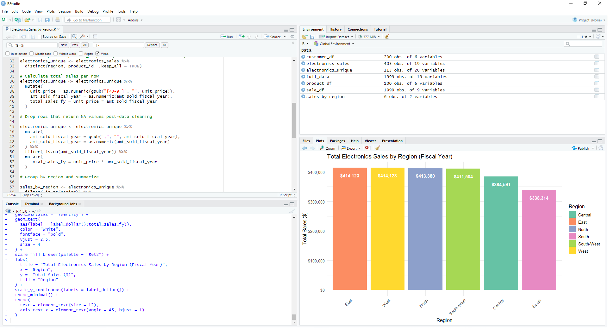

# smart-store-justindavidson
Module 1 Assignment for CSIS 44632

# Module 2 Changes
Added logger script to utils folder

Added data preparation script to scripts folder

Ran the following scripts 

```shell
git pull
py -m venv .venv
.venv\Scripts\activate
py -m pip install --upgrade pip setuptools wheel
py -m pip install --upgrade -r requirements.txt --timeout 100
py scripts/data_prep.py
```
Ran the following scripts to push changes to Github repo.

```shell
git add .
git commit -m "ran initial data_prep.py"
git push -u origin main
```
# Module 3 Changes
Added data scrubber script

Added data preparation scripts 

Added output of data preparation scripts (new csv files found in data/prepared)

# Module 4 Changes
Added a script to perform ETL processes and put the smart sales data into a datawarehouse.

Table schema was determined by taking sales data to be the facts table and using customers and product data to make dimension tables. 

Challenges encountered were improper naming of my columns, but once I got those resolved the .db file was generated with no issues. 

May have had issues with my data scrubber not fulling cleaning data either because a duplicate sales record still existed in my sales file (whoops).

Below are screenshots of my smart_sales.db tables:


It's cool being able to add screenshots to markdown files.

# Module 5 Changes

Used Power BI to generate the below visualizations:


# Module 6 Project Work

### Section 1
The business goal of this project is to explore which region's customers are buying the most electronics. 
We're having trouble with transportation costs with our electronic goods and are investigating customer's purchasing habits. If regional electronic sales are not meeting a specific dollar amount, we're going to warehouse electronics at for said region(s) at HQ and ship them on-demand rather than aiming to keep the store stocked at all times.

### Section 2
The data used in this analysis is coming from a data warehouse and prepared `csv` files comprised of customer data, product data, and sales data for 5/4/2025. The sales data for 5/4/2025 has a running column that shows how many of a given product id has been sold in the fiscal year.

### Section 3
The tools used for this are `Excel` for data cleaning, `Python` and `SQLite` for making a data warehouse in the form of a `.db` file, and `R` for the data transformation and analysis. We're using these tools because of the following reasons:

- `Excel` is a spread-sheet editor that uses buttons and functions to speed up data cleaning.
- `Python` and `SQLite` together allows us to write scripts to make a server-less database for our data.
- `R` is the tool I personally use the most for OLAP work.

### Section 4
The dimensions of the dataset are short - it's just `region` and `total sales`.

The logic behind this is simple - I use the following `R` code snippet to join the tables I uploaded as dataframes together in to a dataframe called `full_data`:

```
full_data <- sale_df %>%
  left_join(product_df, by = "product_id") %>%
  left_join(customer_df, by = "customer_id") 
  ```
Then I filter out any rows that don't pertain to electronics data as well as any data that shows as NA post-data cleaning. I also delete duplicate product Ids:

```
# Filter for Electronics category
electronics_sales <- full_data %>%
  filter(category == "Electronics")

# Remove duplicate product_id per region to avoid double-counting
electronics_unique <- electronics_sales %>%
  distinct(region, product_id, .keep_all = TRUE)

# Drop rows that return NA values post-data cleaning

 sales_by_region <- electronics_unique %>%
  filter(!is.na(region)) %>% 
  group_by(region) %>%
  summarise(total_sales_fy = sum(total_sales_fy, na.rm = TRUE)) %>%
  arrange(desc(total_sales_fy)) 
  ```

Then I make a dataframe that shows the `region` and `total sales` data from the `electronics_unique` dataframe called `sales_by_region`:

```
# Group by region and summarize

sales_by_region <- electronics_unique %>%
  filter(!is.na(region)) %>% 
  group_by(region) %>%
  summarise(total_sales_fy = sum(total_sales_fy, na.rm = TRUE)) %>%
  arrange(desc(total_sales_fy))
  ```

Lastly, I make a ggplot2 visualization using the following script:
```
ggplot(sales_by_region, aes(x = reorder(region, -total_sales_fy), y = total_sales_fy, fill = region)) +
  geom_bar(stat = "identity") +
  geom_text(
    aes(label = label_dollar()(total_sales_fy)),
    color = "white",
    fontface = "bold",
    vjust = 2.5,  
    size = 4
  ) +
  scale_fill_brewer(palette = "Set2") + 
  labs(
    title = "Total Electronics Sales by Region (Fiscal Year)",
    x = "Region",
    y = "Total Sales ($)",
    fill = "Region"
  ) +
  scale_y_continuous(labels = label_dollar()) +
  theme_minimal() +
  theme(
    text = element_text(size = 12),
    axis.text.x = element_text(angle = 45, hjust = 1)
  )
  ```
The output of the script is this:


### Section 5

The total electronics sales based on the data pool really isn't that different across the regions. A range of sub-$80k between the east and south regions is significant across the fiscal year, but it isn't a super jarring difference. However, it is enough to suggest actions need taken.

### Section 6

My suggestion is to go through with warehousing electronics that are primarily sold in the southern region. More research need to be done to figure out what these goods are, but we're moving forward with the proposed plan in Section 1.

### Section 7

Challenges encountered in analysis included ensuring data was formatted correctly (region case sensitivity in the customer dataframe, unit_price in the product dataframe) as well as ensuring the graph made using the ggplot2 package in R came out correctly. These challenges were overcame via thorough data cleaning (my data cleaning scripts worked, but I still used the PROPER function in Excel to further ensure the regions were in the same case as each other) and then using the functions found in the ggplot2 package to ensure the graph was readable - this included ensuring the y-axis was in dollars rather than scientific notation, putting the labels on the x-axis at an angle for readability, making sure the bars colors weren't too harsh.

Below is a screenshot of my R environment:

